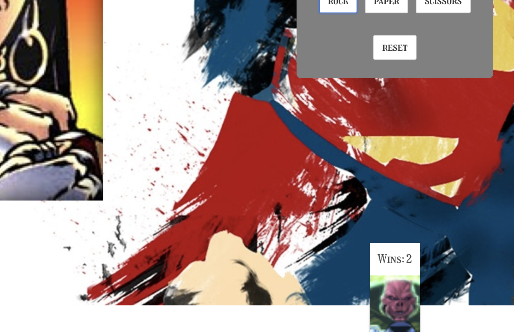
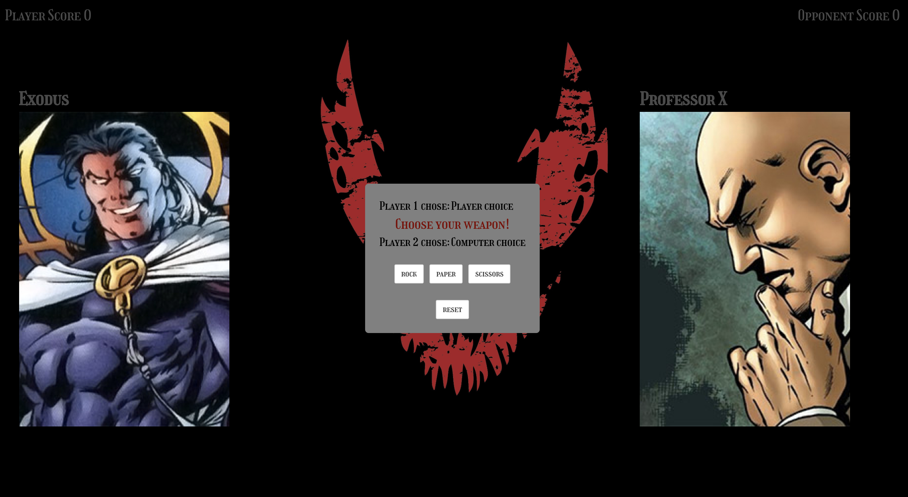

# Project-X-Heroes-vs-Villains

## Overview

This was a weekend project designed to make use of some of the technologies we had learned up to that point in the Software Engineering Immersive program at General Assembly.

We had just been introduced to React.js and shown how to utilise external APIs and so we were encouraged to practice with the creation of an app using any openly available API.

I chose the superhero API and took some inspiration from some of the logic-based exercises we had practiced in class to that point.

The result is rock, paper scissors game utilising the superhero APIs range of supercharacter data called Heroes vs Villains.

Check out the project here: [Heroes-Vs-Villains](https://reggiemenson.com/heroes-vs-villains/)
 
## Technologies Used

#### Core
* HTML5
* CSS3
* JavaScript
* React.js

#### Additional Libraries
* Bulma

#### Bundler
* webpack

#### External APIs

* [Superhero API](https://akabab.github.io/superhero-api/api/)

## Instructions/How to Play


Once the page loads, choose the side that you want to represent. There are two options, light and dark. Once you've made a selection, click begin to start the game.

At the game page, you'll find the player panel on the left with the score printed at the top-left. The right will have the computer's panel and score. Depending on your choice at entry, the player's panel will have an image and name of a randomly generated character from the selected 'side'.

On the central panel is the game's main controls. There are 3 buttons indicating the three selections of rock, paper, scissors and an additional button for a reset.

Click a button to make a choice and start the game. The game operates like the classic version with each choice having a strength and weakness in another one of the choices. The computer will wait on the player to make a choice and then randomly select option. 

If the player wins the result is displayed on the central panel and the player wins the opponents card. The score increments for every victory. The player can then go again with the same character card in play against a new computer character and the process will repeat until the player loses. At that point the computer will claim the player's card and a new player card will be generated for the next face-off. If the player has claimed more than one victory with a character that character will be placed in a 'hall of fame' at the footer of the screen with the character's wins on it.  

## Methodology

This project was created after a review of the superhero API. From a look at the data it was clear that there was a wealth of information on each character and it was consistent enough to make some clear divisions between characters.

Once I was able to divide the characters into two separate groups I started to think about the core logic part of the application.

I decided to make a single call to the application and then filter the data on the application side so that i could make multiple changes to the player and opponent cards without several API calls. I was also able to filter on the categories that was required, that being the characters 'alignment'.

## Features

Once the player had made their choices on the landing page, I needed to store the data in the application, filter it on the selection and then pass it onwards.

The data was filtered with a regular expression:

```
selfAbsorbedRating(shade) {
    const re = new RegExp(shade, 'i')
    return this.state.supes.filter(supes => {
      return re.test(supes.biography.alignment)
    })
  }

```
My creatively named functions were still in the toolkit! I was starting to see with this project how they could prove more disruptive when sharing code even if the intention was a memory aide.

I filtered based on the selection and then I passed the information on using location props and then set it all to the main component's state.

```
    playableCharacters = this.props.location.state.playerCharacters
    otherCharacters = this.props.location.state.compCharacters
    
```
Once there I would push a character forward randomly and then filter them from the full array that was assign after the characters selection.

The logic would then take centre stage with the data pushed around on condition of the outcome which was a simply switch case function.

Wins were tallied with a different variable and on a lose condition this number would be checked. If it was more than 1, a card would be created with the number of wins.




### Challenges

The initial logic was eventually reworked as I wanted to provide a better user experience. Initially, there would be a change on each play regardless of the winner and the winner would retain their card while the loser would be discarded. I felt, however, that a new way would improve the user's experience and create a sense of achievement in the capture of cards that aren't their own as well as a desire to collect wins for a desired character.

My first attempt would attribute a dynamic variable to a character card that won, which would ultimately change each time the 'wins in a row' would change and therefore I had to get creative with how it would be displayed:

```
listWinners(winsInRow) {
    record.push(winsInRow)
    winnerVariable.push(this.state.playerFighter)
    playerWinners = winnerVariable.map((rowWinner, i) => {
      return (<div key={i}>
        <header className="card-header">
          <p className="record-wins">Wins: {record[i]}</p>
        </header>
        <div className="card-image">
          <figure className="image">
            </img>
          </figure>
        </div>
      </div>)
    })
    this.setState({
      playerWinners
    })

  }

```

This function would ensure that cards were generated with the number of wins by referencing a different array variable. Ultimately, each record collected on a character’s run would be able to be displayed at the top of the card.

### Wins

I was really able to work on the React concepts that we had been given as well as practice some of the ES6 array methods we had previously attempted in class in a practical fashion here. 

I developed a better understanding of props and the location property through the shift in the game views and got to play with the data in accordance to the requirements in the game.


## Concluding Thoughts

The timeframe for this project was quite short as it was between official projects so the scope was kept small. We were encouraged to make little additions if possible and so when I could I built it with the technologies that were available at the time of project commencement.

#### More Screenshots




### Future Features

In order to improve playability further, there would be single page views of both the cards that had been captured and the ones that had 'wins in a row', with the reward of more character information. More styling work would be added on the main board as well.

 

